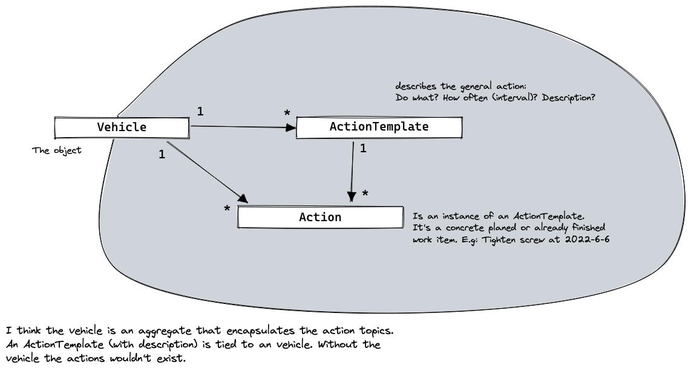
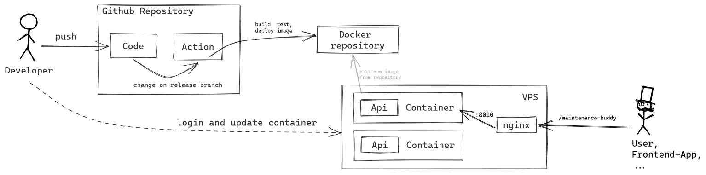

# Development log

Thoughts, opinions and decissions during the development process of the maintenance buddy app.

# start with the backend and create asp.net boilerplate api project
# create a little concept of the domain

# strive for TDD and setup a test environment
- Unit-tests: 
  - should be possible
  - no much setup
- Integration test: 
  - want to test the whole api
  - therefore create a test-project that spins up the webserver and provides a client to test api calls

## create integration test project + write first integration test

https://github.com/georg-braun/maintenance-buddy/commit/ac9ad7354161014ea05d31b6660e3188eb88fd79

# Resume:
- [x] setup project
- [x] setup integration tests
- [x] write first test

# Next: Deployment
- there are many possible traps in the release/deployment process
- deploy at the start of the project to identify these traps. It's not cool if you have a finished product that only runs local on your machine.

The idea is to deploy the api as container on my virtual private server. This is not super fancy and automated. But it's simple and does the job.

## create docker container
https://github.com/georg-braun/maintenance-buddy/commit/068b7985392741b8a5a43c63211a0197e264ac92

## create github action to push the image
- create github action, that builds the docker image and uploads it to a image repository (dockerhub)
  - necessary to add dockerhub credentials as github secrets
    - user
    - token (you can create this token in the dockerhub settings)
  - action only triggers on the release branch
    - create release branch
    - create pull request to release a new version of the api

## start the container on my vps
- copy the compose file to my vps
- start the api with `docker-compose up -d`

## reach the status endpoint of the api
- at the moment the api is running in a container inside my vps. But the exposed container port isn't reachable from outside the vps
- I have a (nginx) reverse proxy that route the incoming requests to my (container) apps on the vps. Therefore I have to add an additional nginx rule to reach the service. Restart nginx to apply the rule. Done :).

# Develop the actual app

# implement api

## start with aggregate and tests

New aggregate concept:
- Vehicle -> ActionTemplate -> Action

write simple add / remove tests

## implement necessary endpoints in tdd manner

Keep application code simple. No extra MediatR or service layer. YAGNI.

- [x] create vehicle
- [x] add action template
- [x] remove action template
- [x] add action
- [ ] remove action

## add authentication

# implement frontend